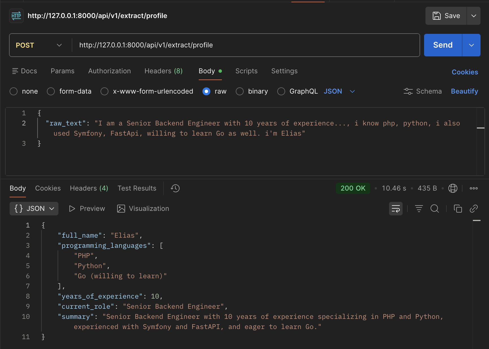

# 🚀 Applied AI Engineering: Week 01 - Structured Outputs

This project demonstrates a production-grade AI backend designed to transform unstructured professional text (resumes, bios, LinkedIn profiles) into validated, strongly-typed JSON objects.

## 🛠️ Tech Stack
- **Framework:** FastAPI (Python 3.9+)
- **Validation:** Pydantic v2
- **AI Engine:** OpenAI GPT-5-mini (Reasoning Model)
- **Interface:** RESTful API with versioned routing (`/api/v1`)

## 🧠 Core Concept: Constrained Decoding
Instead of just "prompting" the AI and hoping for JSON, this project utilizes **OpenAI Structured Outputs**. By passing a Pydantic schema (`TechProfile`) directly to the `.parse()` method, we ensure a **100% schema compliance guarantee**.

## 📁 Project Structure
```text
.
├── app/
│   ├── main.py              # App Entry Point
│   ├── api/v1/              # Versioned API Routes
│   ├── schemas/             # Pydantic Entities (TechProfile, etc.)
│   ├── services/            # AI Logic & OpenAI Integration
│   └── core/                # Configuration & Env Management
└── .env                     # Secrets (API Keys)
```

## 📸 Demonstration
Below is a successful extraction where a messy natural language string is parsed into a clean JSON structure:

